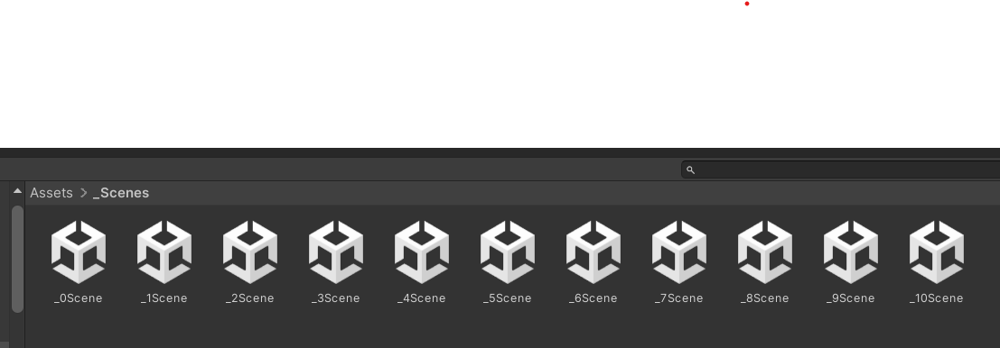

# АНАЛИЗ ДАННЫХ И ИСКУССТВЕННЫЙ ИНТЕЛЛЕКТ [in GameDev]
Отчет по лабораторной работе #3 выполнил:
- Утев Денис Сергеевич
- РИ220944
Отметка о выполнении заданий:

| Задание | Выполнение | Баллы |
| ------ | ------ | ------ |
| Задание 1 | * | 60 |
| Задание 2 | * | 20 |
| Задание 3 | # | 20 |

знак "*" - задание выполнено; знак "#" - задание не выполнено;

Работу проверили:
- к.т.н., доцент Денисов Д.В.
- к.э.н., доцент Панов М.А.
- ст. преп., Фадеев В.О.

[](https://nodesource.com/products/nsolid)


## Цель работы
Выполнить все задания из воркшопа3.

## Задание 1
Ход работы:
- Предложить вариант изменения найденных переменных для 10 уровней в игре. 
- Визуализировать изменение уровня сложности в таблице. 

Мои предложения:
- 1 уровень оставить как есть. Он нормальный. У дракона: speed = 4. chanceDirection = 0.01f. timeBetweenEggDrops = 2.
- 2 уровень. Изменить переменную speed класса EnemyDragon, сделать равной 7. Изменить в том же классе chanceDirection, сделать равной 0.05f.
- 3 уровень. speed у дракона увеличить до 9, timeBetweenEggDrops сделать равной 1.4f, chanceDirection = 0.05f.
- 4 уровень. speed = 11. timeBetweenEggDrops = 1f.  chanceDirection = 0.03f.
- 5 уровень. Характеристики дракона не меняем. Дальше меняем переменные у класса DragonPicker. numEnergyShield = 2. energyShieldRadius = 2f. energyShieldBottomY = -6.8f.
- 6 уровень. energyShieldRadius = 1.5f. energyShieldBottomY = -6.
- 7 уровень. energyShieldRadius = 1.
- 8 уровень. Возрващаемся к классу дракона. speed = 13. timeBetweenEggDrops = 0.88f. chanceDirection = 0.03f.
- 9 уровень. speed = 15. timeBetweenEggDrops = 0.7f.
- 10 уровень. speed = 16. timeBetweenEggDrops = 0.6f. chanceDirection = 0.04f. У класса DragonPicker numEnergyShield = 1.

Вот таблица с графиком изменения уровня сложности игры:

https://docs.google.com/spreadsheets/d/17r_tGyt3SeKF-OGTUGGORN4IO5c8MmmZCC8MUShhRmk/edit?usp=sharing


## Задание 2
Ход работы:
-  Создать 10 сцен на Unity с изменяющимся уровнем сложности.

Я создал 10 сцен с изменяющимся уровнем сложности, как в моих предложениях из первого задания.



## Задание 3
Ход работы: 
- Решение должно заполнять google-таблицу данными из Python. В Python данные также должны быть визуализированы.


```python

```

Код:
[Относительная ссылка на документ](assets/UnityBihaviourScrpit.cs)


## Выводы

Я выполнил задания воркшопа3.

| Plugin | README |
| ------ | ------ |
| Dropbox | [plugins/dropbox/README.md][PlDb] |
| GitHub | [plugins/github/README.md][PlGh] |
| Google Drive | [plugins/googledrive/README.md][PlGd] |
| OneDrive | [plugins/onedrive/README.md][PlOd] |
| Medium | [plugins/medium/README.md][PlMe] |
| Google Analytics | [plugins/googleanalytics/README.md][PlGa] |

## Powered by

**UTEV DENIS**
